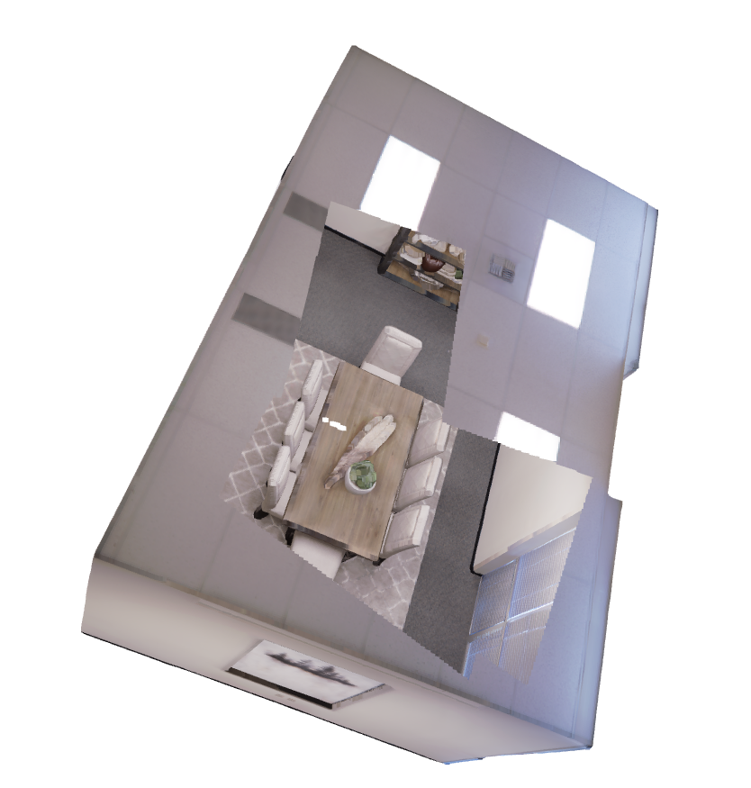

# A_star
A_star path searching based on open3d VoxelGrid

# Install 
pip install numpy  
pip install open3d  
pip install time  

# How to use 
python main.py 

The searched path points are saved in the **path_list** variable  

# Visualization  

 